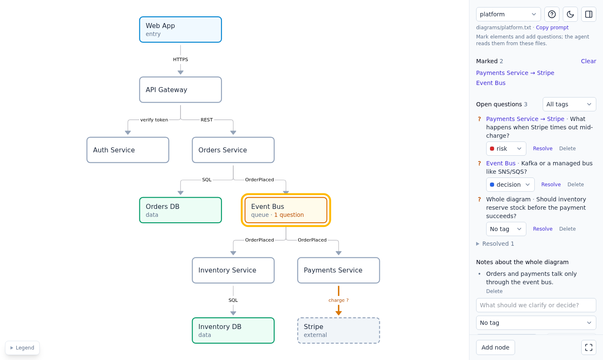

# Diagram canvas skill

An agent skill for drawing architecture and workflow diagrams together with a coding agent. The
diagram lives in plain text files in your project. You look at it and edit it on a canvas in the
browser, the agent edits the same files, and both sides see each other's changes right away.

To point the agent at something, you mark nodes and connections and leave notes and questions on
them. The agent reads them, answers or changes the diagram, and resolves the questions.



## Install

Download the skill from the latest release into your skills folder:

```sh
curl -fsSLO https://github.com/Visorian/diagram-canvas-skill/releases/latest/download/diagram-canvas.zip
unzip -o diagram-canvas.zip -d ~/.claude/skills/ && rm diagram-canvas.zip
```

The canvas needs Node 20+ or Bun.

## Use

Ask the agent for a diagram, for example "Map the services in this repo as a diagram and open the
canvas". It writes `diagrams/<name>.txt`, starts the canvas and gives you a link.

On the canvas:

- Select an element and press `M` to mark it, `Q` to ask a question or `N` to add a note.
- Drag from a node's dot to connect it, and right-click for more actions. The `?` button lists all
  shortcuts.
- Use "Copy prompt" in the sidebar and paste it into the chat to send the agent to your marks and
  questions.

A diagram is a few small files you can commit and review like code:

```
diagrams/platform.txt          nodes and connections
diagrams/platform.notes.md     notes and questions
diagrams/platform.layout.json  positions you dragged
diagrams/platform.marks        current marks, short-lived
```

The format is documented in [`skill/SKILL.md`](skill/SKILL.md).

## Develop

```sh
bun install
bun run dev      # canvas for diagrams/ at http://localhost:5173/?diagram=platform
bun run check    # format, lint, typecheck, test and build
```

`bun run build` writes the bundled `dist/canvas.js`, a read-only `dist/viewer.html` and the skill
in `dist/skill/`. `bun run install:skill` builds the skill and copies it to
`~/.claude/skills/diagram-canvas/`.

## License

[MIT](LICENSE)
